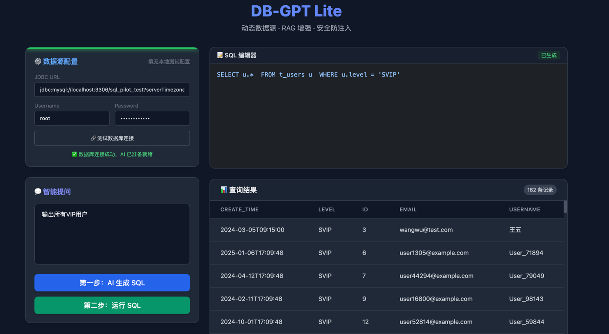
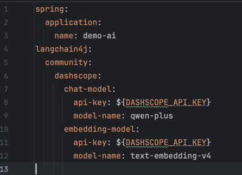

# DB-GPT Lite (智能 SQL 助手)

> 一个基于 Spring Boot + LangChain4j + RAG的 AIGC 工具，让非技术人员也能通过自然语言查询数据库。

## ✨ 项目简介

**Text2Sql** 是一个轻量级的 AI 辅助工具。它利用大模型（LLM）的能力，将用户的自然语言问题（如“查询消费最高的3个用户”）自动转换为可执行的 SQL 语句，并直接在页面展示查询结果。

不再需要手写复杂的 SQL，让数据查询变得像聊天一样简单。

## ✨ 运行效果

上图展示了 DB-GPT Lite 的界面，专注于开发者的沉浸式体验。

**界面核心区域说明：**

* **左侧：控制面板 (Control Panel)**
    * **数据源配置**：支持动态输入任意 JDBC URL、账号密码，并提供 **“一键测试连接”** 功能，连接成功后顶部会出现绿色状态指示条。
    * **智能提问区**：用户在此输入自然语言业务问题（如：“查询上个月消费最高的前 3 位用户”）。
    * **操作流**：清晰的“生成 SQL” -> “执行 SQL” 两步走操作，防止 AI 误操作，给予用户二次确认的机会。

* **右侧：结果反馈 (Result Dashboard)**
    * **SQL 编辑器**：高亮显示 AI 生成的 SQL 语句。支持用户手动微调 SQL，满足复杂场景需求。
    * **数据结果表**：执行成功后，自动渲染查询结果集，支持动态列头解析，直观展示业务数据。

## 🌟 核心特性

- **🚀 Text-to-SQL**: 自动将自然语言转换为标准 SQL。
- **🧠 RAG 增强**: 支持外挂业务文档 (`docs/` 目录)，让 AI 理解企业专属术语。
- **🛡️ 安全防御**: 内置正则拦截与只读锁，防止 `DELETE`/`DROP` 等危险操作。
- **🔌 动态数据源**: 前端可配置任意 JDBC 连接，无需修改后端代码。
- **📊 可视化结果**: 自动渲染查询结果表格。

## 🛠️ 技术栈

- **后端**: Java 21, Spring Boot 3, LangChain4j, RAG
- **AI 模型**: 阿里云通义千问 (Qwen-Plus) + DashScope Embedding
- **前端**: Vue 3 (CDN 模式) + Tailwind CSS
- **数据库**: MySQL 8.0+

## 🚀 快速开始

### 1. 环境准备
- JDK 17+
- Maven 3.6+
- 一个可用的 MySQL 数据库

### 2. 克隆项目
```bash
git clone [https://github.com/kang-yang77/Text2Sql.git](https://github.com/kang-yang77/Text2Sql.git)
cd Text2Sql
```
### 3. 配置
#### 1.大模型配置

如上图，配置自己的api-key以及chat-model

#### 2.知识库配置
本项目利用 RAG 技术让 AI 理解您的私有数据库结构和业务术语。系统启动时会自动加载项目根目录 `docs/` 文件夹下的所有文档。

**如何配置：**
1. 找到项目根目录下的 **`docs/`** 文件夹（与 `pom.xml` 同级）。
2. 删除默认的示例文件（如 `business_glossary.md`）。
3. 创建新的 Markdown (`.md`) 文件，填入您的业务知识。

**⚠️ 注意**：文档修改后，需要**重启应用**才会生效（因为向量索引是在启动时构建的）。

### 4. 测试运行
项目启动成功后（控制台显示 `Started ...`），请打开浏览器访问：

👉 **[http://localhost:8080/index.html](http://localhost:8080/index.html)**

**使用步骤：**
1. 在页面左侧配置数据库连接（支持任意 MySQL 数据库）。
2. 点击 **“测试连接”** 确保网络通畅。
3. 输入问题并点击生成，即可体验 AI 自动查询。


